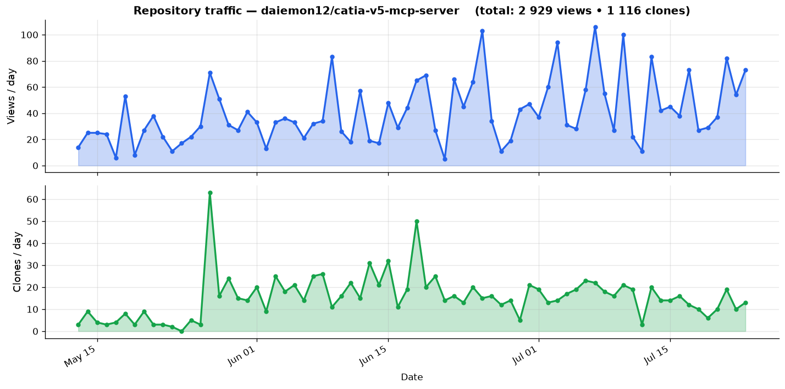

# CATIA V5 MCP Server

> Connect Claude AI to Dassault Systemes CATIA V5 via the Model Context Protocol (MCP).

[](traffic/clones.json)
[](traffic/views.json)

The first open-source MCP server for CATIA V5. Drive CATIA V5 CAD modeling from Claude Desktop or Claude Code using natural language.



**GSD extension in progress:** [`docs/PLAN.md`](docs/PLAN.md) is the implementation
plan for the Generative Shape Design (surfacing) tools, and
[`docs/DEPLOYMENT.md`](docs/DEPLOYMENT.md) documents the live HTTP deployment against
a real CATIA install, including why several simpler approaches don't work. Read both
before extending or redeploying this server.

## What it does

This MCP server exposes **100+ tools** that let Claude:

- **Create and manage documents** — new Part, Product (assembly), open, save, close
- **2D Sketching** — lines, rectangles, circles, arcs, splines, points, constraints
- **Part Design** — Pad, Pocket, Shaft, Groove, Fillet, Chamfer, Hole, Shell, Draft, Thickness, Patterns (rectangular/circular), Mirror
- **Assembly** — add components, Fix/Coincidence/Offset/Angle constraints, move/rotate
- **Measurement** — distance, inertia, bounding box, parameters
- **Export** — STEP, IGES, STL, 3DXML, VRML, screenshots
- **Generative Shape Design** — geometrical sets, stable references, 3D wireframe,
  lofts, sweeps, blends, joins, trims, offsets, and surface-to-solid conversion
- **Parametric wheels** — validated cast-style wheel blanks driven by named
  dimensions and exported to CATPart/STEP for downstream engineering
- **View control** — set standard views, fit all, capture screenshots

## Requirements

- **Windows** (COM automation is Windows-only)
- **CATIA V5** installed and licensed (R2016+)
- **CATIA Part Design and Generative Shape Design licenses** for advanced and wheel tools
- **Python 3.10+**
- **Claude Desktop** or **Claude Code**

## Quick Install (Recommended)

```bash
git clone https://github.com/daiemon12/catia-v5-mcp-server.git
cd catia-v5-mcp-server
bash setup.sh
```

The script handles everything: dependencies, Claude Desktop config, and verification.

## Manual Installation

### 1. Clone the repository

```bash
git clone https://github.com/daiemon12/catia-v5-mcp-server.git
cd catia-v5-mcp-server
```

### 2. Install dependencies

```bash
pip install -e .
```

Or manually:
```bash
pip install mcp pywin32 pycatia
```

**Windows: running this via a PowerShell script.** If you wrap the steps above in a
`.ps1` script (for example an offline installer that copies the repo and a local wheel
cache onto a machine with no internet access), running it directly may fail with:

```
File ...\install.ps1 cannot be loaded because running scripts is disabled on this system.
```

Don't change the system-wide execution policy to fix this. Instead bypass it for just
that one run:

```powershell
powershell -ExecutionPolicy Bypass -File .\install.ps1
```

Also run it from a **normal, non-elevated** PowerShell window — not "Run as
Administrator". This isn't just a permissions nicety: as noted below, CATIA's COM
object is only visible to processes in the same interactive logon session *and*
integrity level. An elevated process, even under the same account in the same
session, frequently can't see a non-elevated CATIA instance — the same failure mode
as running the server from a scheduled task.

### 3. Configure Claude Desktop

Edit your Claude Desktop config file:
- Windows: `%APPDATA%\Claude\claude_desktop_config.json`
- macOS: `~/Library/Application Support/Claude/claude_desktop_config.json`

Add the server:

```json
{
  "mcpServers": {
    "catia-v5": {
      "command": "python",
      "args": ["-m", "catia_mcp"]
    }
  }
}
```

Or with an absolute path:

```json
{
  "mcpServers": {
    "catia-v5": {
      "command": "python",
      "args": ["C:/path/to/catia-v5-mcp-server/catia_mcp/server.py"]
    }
  }
}
```

### 4. For Claude Code

```bash
claude mcp add catia-v5 python -- -m catia_mcp
```

### 5. Start CATIA V5

Make sure CATIA V5 is running before asking Claude to interact with it. The server will automatically connect to the running instance.

If CATIA V5 is not running, the server will attempt to launch it (requires CATIA to be registered as COM server: `cnext.exe /regserver`).

## Remote deployment (HTTP transport)

By default the server talks to Claude over **stdio**, and Claude launches it as a
child process — so the server must run on the same machine, in the same
interactive desktop session, as CATIA. This is a hard requirement, not a
convenience: CATIA's COM `GetActiveObject` only sees instances registered in
the **same Windows logon session's Running Object Table**. A process launched
elevated, via a scheduled task, or over SSH lands in a *different* session and
cannot find an already-running CATIA, even under the same user account.

If Claude Code runs on a different machine than CATIA (e.g. connecting over a
VPN to a CAD workstation), use the **Streamable HTTP transport** instead. The
server still runs inside CATIA's own interactive session — non-elevated, same
user — but Claude reaches it over the network rather than spawning it directly:

```powershell
# On the CATIA machine, in a normal (non-elevated) session:
set CATIA_MCP_TOKEN=<a long random token>
python -m catia_mcp --http --host <this-machine-ip> --port 8000 --allowed-host <this-machine-ip>:8000
```

Then register it from the client as an HTTP MCP server:

```bash
claude mcp add --transport http catia-v5 http://<catia-machine-ip>:8000/mcp/ \
  --header "Authorization: Bearer <the-same-token>"
```

**Security notes** — this endpoint executes CATIA automation and file I/O, so treat it
like any other network service:
- `--host` defaults to `127.0.0.1`; only bind it to the actual VPN/LAN interface,
  never `0.0.0.0`, and never expose it to the open internet.
- Always set `CATIA_MCP_TOKEN`. Without it the server logs a warning and accepts
  unauthenticated requests.
- `--allowed-host` populates the Streamable HTTP DNS-rebinding guard; set it to
  the exact `host:port` clients will use in their `Host` header.
- Firewall the port to the specific client IP(s) that need it
  (`New-NetFirewallRule ... -RemoteAddress <client-ip>`), not the whole subnet.
- If CATIA is on a network with no internet access, `mcp`/`pywin32`/`pycatia`
  can be installed offline via `pip install --no-index --find-links <wheels-dir> ...`
  after downloading the wheels on a connected machine
  (`pip download ... --platform win_amd64 --python-version <ver> --only-binary=:all:`).

## Usage Examples

Once configured, just talk to Claude:

### Create a simple part
> "Create a new CATIA part. Draw a 100x60mm rectangle centered at the origin on the XY plane, then extrude it 40mm."

### Design a bracket
> "Design a mounting bracket: start with a 120x80mm base plate, 5mm thick. Add 4 M6 mounting holes at the corners with 10mm edge distance. Then add two vertical ribs 30mm tall."

### Parametric modification
> "Show me all parameters of the active part. Then change the pad height to 60mm."

### Export for manufacturing
> "Export the current part to STEP format at C:/export/bracket.stp and take a screenshot of the isometric view."

### Assembly
> "Create a new assembly. Add the bracket from C:/parts/bracket.CATPart and the base from C:/parts/base.CATPart. Fix the base, then create a coincidence constraint between the two."

## Architecture

```
catia-v5-mcp-server/
├── catia_mcp/
│   ├── __init__.py
│   ├── __main__.py               # python -m catia_mcp entry point
│   ├── server.py                 # MCP Server — tool registration, routing, stdio/HTTP transports
│   ├── connection.py             # COM connection manager (win32com + pycatia)
│   └── tools/
│       ├── __init__.py
│       ├── document.py           # Document management (9 tools)
│       ├── sketcher.py           # 2D Sketch tools (11 tools)
│       ├── part_design.py        # 3D Part Design features (15 tools)
│       ├── part_design_advanced.py  # Surface-to-solid, advanced fillets
│       ├── assembly.py           # Assembly/Product tools (9 tools)
│       ├── measurement.py        # Measurement & analysis (6 tools)
│       ├── export.py             # Export & view control (4 tools)
│       ├── geoset.py             # Geometrical sets & stable reference resolution
│       ├── wireframe.py          # 3D wireframe (points, lines, splines, helix)
│       ├── surface.py            # GSD surfaces (loft, sweep, blend, fill, join)
│       ├── knowledge.py          # Parameters & formulas
│       ├── wheel.py              # Parametric wheel composite tool
│       └── _geometry.py          # Shared geometry helpers
├── tests/
├── pyproject.toml
├── requirements.txt
└── README.md
```

### How it works

The server supports two transports; pick based on whether Claude and CATIA run
on the same machine.

**stdio** (default — same machine as CATIA):
```
Claude (Desktop/Code)  ──stdio (MCP JSON-RPC)──▶  catia_mcp/server.py
                                                        │ tool routing
                                                        ▼
                                                catia_mcp/tools/*.py
                                                        │ win32com / pycatia (COM)
                                                        ▼
                                                  CATIA V5 Application
```

**Streamable HTTP** (`--http` — Claude on a different machine, server stays
inside CATIA's interactive session; see [Remote deployment](#remote-deployment-http-transport)):
```
Claude (Desktop/Code)  ──HTTP + Bearer token, over LAN/VPN──▶  catia_mcp/server.py (uvicorn)
                                                                     │ tool routing
                                                                     ▼
                                                             catia_mcp/tools/*.py
                                                                     │ win32com / pycatia (COM,
                                                                     │ same logon session as CATIA)
                                                                     ▼
                                                               CATIA V5 Application
```

1. Claude sends MCP tool calls over stdio or HTTP
2. The server routes each call to the appropriate tool module
3. Each tool module uses `win32com.client` or `pycatia` to drive CATIA V5 via COM
4. Results (JSON, text) are returned to Claude

## Tool Reference

### Document Tools (9)
| Tool | Description |
|------|-------------|
| `catia_connect` | Connect to CATIA V5 |
| `catia_disconnect` | Disconnect from CATIA V5 |
| `catia_new_part` | Create a new Part document |
| `catia_new_product` | Create a new Product (assembly) |
| `catia_open_document` | Open an existing document |
| `catia_save_document` | Save / Save As |
| `catia_close_document` | Close active document |
| `catia_list_documents` | List all open documents |
| `catia_get_active_document_info` | Get detailed info about active document |

### Sketcher Tools (11)
| Tool | Description |
|------|-------------|
| `catia_create_sketch` | Create sketch on XY/YZ/ZX plane |
| `catia_close_sketch` | Close sketch, return to Part Design |
| `catia_sketch_line` | Draw a line |
| `catia_sketch_rectangle` | Draw a rectangle (2 corners) |
| `catia_sketch_centered_rectangle` | Draw a centered rectangle |
| `catia_sketch_circle` | Draw a circle |
| `catia_sketch_arc` | Draw an arc |
| `catia_sketch_spline` | Draw a spline through points |
| `catia_sketch_point` | Create a point |
| `catia_sketch_constraint` | Add dimensional/geometric constraint |
| `catia_sketch_get_geometry` | List sketch geometry elements |

### Part Design Tools (15)
| Tool | Description |
|------|-------------|
| `catia_pad` | Pad (extrusion) |
| `catia_pocket` | Pocket (cut extrusion) |
| `catia_shaft` | Shaft (revolution) |
| `catia_groove` | Groove (revolution cut) |
| `catia_fillet` | Fillet (edge rounding) |
| `catia_chamfer` | Chamfer (edge bevel) |
| `catia_hole` | Hole (simple, counterbored, countersunk) |
| `catia_rect_pattern` | Rectangular pattern |
| `catia_circ_pattern` | Circular pattern |
| `catia_mirror` | Mirror about a plane |
| `catia_shell` | Shell (hollow out) |
| `catia_draft` | Draft angle |
| `catia_thickness` | Thickness offset |
| `catia_list_features` | List features in body |
| `catia_list_edges` | List edges for fillet/chamfer |

### Assembly Tools (9)
| Tool | Description |
|------|-------------|
| `catia_add_component` | Add existing part to assembly |
| `catia_add_new_part` | Create new part in assembly |
| `catia_fix_constraint` | Fix a component in place |
| `catia_coincidence_constraint` | Coincidence constraint |
| `catia_offset_constraint` | Offset constraint |
| `catia_angle_constraint` | Angle constraint |
| `catia_move_component` | Move/rotate a component |
| `catia_list_components` | List assembly components |
| `catia_list_constraints` | List assembly constraints |

### Measurement Tools (6)
| Tool | Description |
|------|-------------|
| `catia_measure_distance` | Measure distance between elements |
| `catia_get_inertia` | Volume, area, mass, center of gravity |
| `catia_get_bounding_box` | Bounding box dimensions |
| `catia_get_parameters` | List all parameters |
| `catia_set_parameter` | Modify a parameter value |
| `catia_update_part` | Force rebuild |

### Export Tools (4)
| Tool | Description |
|------|-------------|
| `catia_export` | Export to STEP/IGES/STL/3DXML/VRML/PDF |
| `catia_screenshot` | Capture 3D view to image (JPEG/BMP/TIFF/EMF) |
| `catia_set_view` | Set view orientation |
| `catia_fit_all` | Fit all in view |

### Drawing Tools (8)
2D drafting: generate associative drawing views from an open 3D part, then export to PDF.
| Tool | Description |
|------|-------------|
| `catia_new_drawing` | Create a CATDrawing and set sheet paper size/orientation/scale |
| `catia_drawing_base_view` | Generative view from a 3D part (front/back/top/bottom/left/right/iso) |
| `catia_drawing_projection_view` | Projection view (right/left/top/bottom) off a parent view |
| `catia_drawing_section_view` | Section view cut by a profile polyline |
| `catia_drawing_detail_view` | Circular detail (blow-up) view |
| `catia_drawing_update` | Regenerate all generative views |
| `catia_drawing_info` | List sheets and views |
| `catia_drawing_from_part` | One call: front+right+top+iso views + optional PDF |

## Generative Shape Design and wheels

The GSD extension adds geometrical-set and stable-reference tools, 3D wireframe
construction, surface loft/sweep/blend/join operations, surface-to-solid
features, advanced casting fillets/draft, and Knowledgeware parameters. Use
`catia_design_wheel` for the validated `simple_lofted` wheel family.

Geometry-producing tools return a reusable reference handle such as:

```json
{"name": "SpokeGuide.1", "kind": "feature"}
```

Face, edge, and vertex handles can additionally contain a persistent CATIA
`brep_name`. Pass these handles directly to later GSD tools instead of relying
on the current selection or an unstable topology index.

The wheel tool produces a parametric, rebuildable wheel blank and CATPart/STEP
outputs for downstream engineering. It does **not** provide Class-A styling,
GD&T, DFM approval, FEA, fatigue/impact certification, or regulatory approval.
Final valve drilling, back-cavity optimization, surface crowns, drafts, and
fillet topology must be qualified in the target CATIA release before release to
manufacturing.

## Troubleshooting

### "pywin32 is not installed"
```bash
pip install pywin32
```
This server requires Windows. It will not work on macOS or Linux.

### "Failed to connect to CATIA V5"
1. Make sure CATIA V5 is running
2. Register CATIA as COM server: navigate to `C:\Program Files\Dassault Systemes\B<version>\<os>\code\bin\` and run `cnext.exe /regserver`
3. Check that no modal dialog is blocking CATIA

### "No active document"
Create or open a document first using `catia_new_part` or `catia_open_document`.

### COM ByRef array limitations
Some measurement methods may not work with late binding. The GSD and advanced Part Design tools use `pycatia` (early-binding) internally for this reason; if a raw `win32com` call fails with a ByRef/array error, check whether a `pycatia`-backed equivalent exists first.

### HTTP transport: "Unauthorized" or connection refused
See [Remote deployment](#remote-deployment-http-transport) — check `CATIA_MCP_TOKEN` matches on both ends, that `--allowed-host` matches the `Host` header the client sends, and that the firewall rule permits the client's IP.

## Contributing

This project is open-source. Contributions welcome:

- **Drawing** tools (2D drafting)
- **Knowledgeware** — design tables (formulas/parameters are implemented)
- **Robust sub-element selection** — resolving faces/edges by geometric query
  (normal direction, proximity) rather than name/index; the current GSD tools
  resolve references by name, which is fragile for faces/edges that don't have
  a stable name across rebuilds
- **Tests** with COM mocking
- **3DEXPERIENCE** CATIA support

## License

MIT

## Credits

Inspired by:
- [SolidWorks-MCP](https://github.com/Sam-Of-The-Arth/SolidWorks-MCP)
- [freecad-mcp](https://github.com/contextform/freecad-mcp)
- [abaqus-mcp-server](https://github.com/jianzhichun/abaqus-mcp-server)
- [pycatia](https://github.com/evereux/pycatia)

The Generative Shape Design tools (`geoset.py`, `wireframe.py`, `surface.py`,
surface-to-solid features in `part_design_advanced.py`, and the formula
helpers in `knowledge.py`) were adapted from
[tongriyaotxt/catia-mcp](https://github.com/tongriyaotxt/catia-mcp), which
declares an MIT license in `pyproject.toml`/README but does not ship a
`LICENSE` file in the repository as of this writing.
