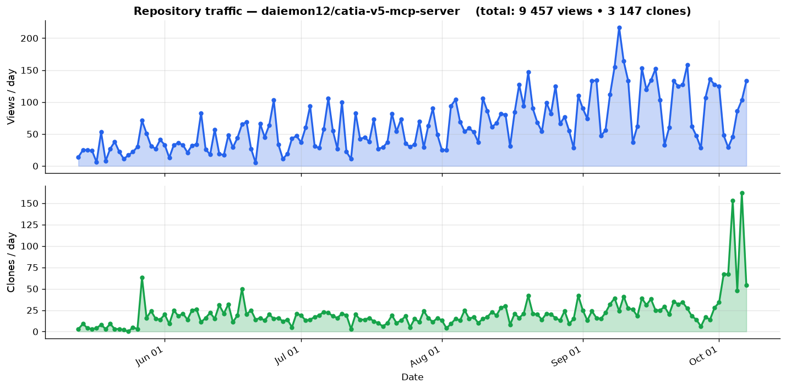

# CATIA V5 MCP Server

> Connect AI agents to Dassault Systemes CATIA V5 via the Model Context Protocol (MCP) — works with Claude, Cursor, Windsurf, Cline, VS Code, Codex and any MCP-compatible client.

[](https://github.com/daiemon12/catia-v5-mcp-server/releases)
[](https://github.com/daiemon12/catia-v5-mcp-server/actions/workflows/ci.yml)
[](LICENSE)
[](traffic/clones.json)
[](traffic/views.json)

The first open-source MCP server for CATIA V5. Drive parametric CAD modeling, measurement, drawing export and COM automation in natural language, from any AI agent that speaks MCP.



## What it does

This MCP server exposes **87 tools** that let an AI agent:

- **Create and manage documents** — new Part, Product (assembly), open, save, close
- **2D Sketching** — lines, rectangles, circles, arcs, splines, points, constraints
- **Part Design** — Pad, Pocket, Shaft, Groove, Fillet, Chamfer, Hole, Shell, Draft, Thickness, Patterns (rectangular/circular/user), Mirror
- **Generative Shape Design (GSD)** — 3D wireframe (points, lines, planes, splines, circles), Multi-sections Surface (loft), Sweep, Extrude, Revolve, Fill, Blend, Offset, Join, Split, Trim, Symmetry, ThickSurface/CloseSurface to solids
- **Assembly** — add components, Fix/Coincidence/Offset/Angle constraints, move/rotate
- **Measurement** — distance, inertia, bounding box, parameters
- **Export** — STEP, IGES, STL, 3DXML, VRML, screenshots
- **View control** — set standard views, fit all, capture screenshots
- **Drafting** — create Drawing documents, generative views (axis- or face-driven) and 3D-driven dimensions (experimental, field-contributed)
- **Diagnostics** — report the CATIA release and probe which automation APIs the installation exposes

## Requirements

- **Windows** (COM automation is Windows-only)
- **CATIA V5** installed and licensed (R2016+)
- **Python 3.10+**
- Any **MCP client**: Claude Desktop, Claude Code, Cursor, Windsurf, Cline, VS Code (Copilot/MCP), Codex CLI, ChatGPT via an HTTP bridge, and others

### Compatibility notes (field reports)

- **V5R20 (2010)**: core workflow confirmed working end to end (document
  management, sketcher, Part Design pad creation, GSD geometrical sets,
  views, screenshots). An initial report of `ShapeFactory.AddNewPad` being
  missing turned out to be a **stale pywin32 `gen_py` cache**, not the
  release: clearing the cache restored the methods (see Troubleshooting).
  Measurement notes for R20: volume, area and parameters work directly;
  array-returning measures go through the SystemService.Evaluate detour
  (proven there for GetPlane; GetCOG and GetPoint use the same route and
  the same mm coordinate convention). The inertia matrix (Inertia object)
  and the vertex-sweep bounding box await live confirmation.
- **V5-6 2020**: full tool surface in active use by contributors.

`catia_measure_distance` accepts tree names (`Pad.1`, `Sketch.2`) and indexed
topology (`Face.N` / `Edge.N` from `catia_list_faces` / `catia_list_edges`).
The topology path follows a V5R20 field diagnosis (selection Reference
property instead of `CreateReferenceFromObject`, which rejects HSO topology)
and awaits live confirmation on real CATIA; reports welcome.

Reports from other releases are welcome, open an issue with your CATIA version
and the tool results (the `catia_diagnose` tool output is the ideal payload).

## Quick Install (Recommended)

```bash
git clone https://github.com/daiemon12/catia-v5-mcp-server.git
cd catia-v5-mcp-server
bash setup.sh
```

The script handles everything: dependencies, Claude Desktop configuration, and verification. Using another MCP client? See the per-client setup below.

## Manual Installation

### 1. Clone the repository

```bash
git clone https://github.com/daiemon12/catia-v5-mcp-server.git
cd catia-v5-mcp-server
```

### 2. Install dependencies

```bash
pip install -e .
```

Or manually:
```bash
pip install mcp pywin32
```

### 3. Connect your MCP client

The server speaks standard MCP over stdio, so it works with every
MCP-compatible client. The command is always the same:
`python -m catia_mcp` (or an absolute path to `catia_mcp/server.py`).

<details>
<summary><b>Claude Desktop</b></summary>

Edit the config file:
- Windows: `%APPDATA%\Claude\claude_desktop_config.json`
- macOS: `~/Library/Application Support/Claude/claude_desktop_config.json`

```json
{
  "mcpServers": {
    "catia-v5": {
      "command": "python",
      "args": ["-m", "catia_mcp"]
    }
  }
}
```
</details>

<details>
<summary><b>Claude Code</b></summary>

```bash
claude mcp add catia-v5 python -- -m catia_mcp
```
</details>

<details>
<summary><b>Cursor</b></summary>

Add to `~/.cursor/mcp.json` (or `.cursor/mcp.json` in your project):

```json
{
  "mcpServers": {
    "catia-v5": {
      "command": "python",
      "args": ["-m", "catia_mcp"]
    }
  }
}
```
</details>

<details>
<summary><b>Windsurf</b></summary>

Add to `~/.codeium/windsurf/mcp_config.json`:

```json
{
  "mcpServers": {
    "catia-v5": {
      "command": "python",
      "args": ["-m", "catia_mcp"]
    }
  }
}
```
</details>

<details>
<summary><b>Cline</b></summary>

In VS Code: Cline icon > MCP Servers > Configure, then add:

```json
{
  "mcpServers": {
    "catia-v5": {
      "command": "python",
      "args": ["-m", "catia_mcp"]
    }
  }
}
```
</details>

<details>
<summary><b>VS Code (GitHub Copilot / native MCP)</b></summary>

Add to `.vscode/mcp.json`:

```json
{
  "servers": {
    "catia-v5": {
      "type": "stdio",
      "command": "python",
      "args": ["-m", "catia_mcp"]
    }
  }
}
```
</details>

<details>
<summary><b>Codex CLI (OpenAI)</b></summary>

Add to `~/.codex/config.toml`:

```toml
[mcp_servers.catia-v5]
command = "python"
args = ["-m", "catia_mcp"]
```
</details>

<details>
<summary><b>ChatGPT (desktop / web)</b></summary>

ChatGPT only connects to remote MCP servers over HTTP, not to local
stdio processes. Expose this server through a stdio-to-HTTP bridge such
as `mcp-proxy` or `supergateway` on the CATIA machine, then add the
resulting URL as a connector in ChatGPT's developer mode. A native HTTP
transport is on the roadmap.
</details>

<details>
<summary><b>Other MCP hosts</b></summary>

Any client that launches stdio MCP servers works: configure a server
named `catia-v5` with command `python` and args `["-m", "catia_mcp"]`,
run from a machine where CATIA V5 is installed.
</details>

### 4. Start CATIA V5

Make sure CATIA V5 is running before asking your agent to interact with it. The server will automatically connect to the running instance.

If CATIA V5 is not running, the server will attempt to launch it (requires CATIA to be registered as COM server: `cnext.exe /regserver`).

## Usage Examples

Once configured, just talk to your AI agent:

### Create a simple part
> "Create a new CATIA part. Draw a 100x60mm rectangle centered at the origin on the XY plane, then extrude it 40mm."

### Design a bracket
> "Design a mounting bracket: start with a 120x80mm base plate, 5mm thick. Add 4 M6 mounting holes at the corners with 10mm edge distance. Then add two vertical ribs 30mm tall."

### Parametric modification
> "Show me all parameters of the active part. Then change the pad height to 60mm."

### Export for manufacturing
> "Export the current part to STEP format at C:/export/bracket.stp and take a screenshot of the isometric view."

### Assembly
> "Create a new assembly. Add the bracket from C:/parts/bracket.CATPart and the base from C:/parts/base.CATPart. Fix the base, then create a coincidence constraint between the two."

## Architecture

```
catia-v5-mcp-server/
├── catia_mcp/
│   ├── __init__.py
│   ├── __main__.py          # python -m catia_mcp entry point
│   ├── server.py            # MCP Server — tool registration & routing
│   ├── connection.py        # COM connection manager (win32com)
│   └── tools/
│       ├── __init__.py
│       ├── document.py      # Document management (9 tools)
│       ├── sketcher.py      # 2D Sketch tools (11 tools)
│       ├── part_design.py   # 3D Part Design features (17 tools)
│       ├── gsd.py           # Generative Shape Design — wireframe & surfaces (24 tools)
│       ├── assembly.py      # Assembly/Product tools (9 tools)
│       ├── measurement.py   # Measurement & analysis (6 tools)
│       ├── drawing.py       # Drafting: drawings, views & dimensions (6 tools)
│       ├── diagnostics.py   # Installation diagnostics (1 tool)
│       └── export.py        # Export & view control (4 tools)
├── pyproject.toml
├── requirements.txt
└── README.md
```

### How it works

```
AI agent (Claude, Cursor, Windsurf, Cline, ...)
    │
    │ stdio (MCP JSON-RPC)
    ▼
catia_mcp/server.py (MCP Server)
    │
    │ Tool routing
    ▼
catia_mcp/tools/*.py (Tool modules)
    │
    │ win32com.client (COM Automation)
    ▼
CATIA V5 Application
```

1. The MCP client sends tool calls over stdio
2. The server routes each call to the appropriate tool module
3. Each tool module uses `win32com.client` to drive CATIA V5 via COM
4. Results (JSON, text) are returned to the agent

## Tool Reference

### Document Tools (9)
| Tool | Description |
|------|-------------|
| `catia_connect` | Connect to CATIA V5 |
| `catia_disconnect` | Disconnect from CATIA V5 |
| `catia_new_part` | Create a new Part document |
| `catia_new_product` | Create a new Product (assembly) |
| `catia_open_document` | Open an existing document |
| `catia_save_document` | Save / Save As |
| `catia_close_document` | Close active document |
| `catia_list_documents` | List all open documents |
| `catia_get_active_document_info` | Get detailed info about active document |

### Sketcher Tools (11)
| Tool | Description |
|------|-------------|
| `catia_create_sketch` | Create sketch on XY/YZ/ZX plane |
| `catia_close_sketch` | Close sketch, return to Part Design |
| `catia_sketch_line` | Draw a line |
| `catia_sketch_rectangle` | Draw a rectangle (2 corners) |
| `catia_sketch_centered_rectangle` | Draw a centered rectangle |
| `catia_sketch_circle` | Draw a circle |
| `catia_sketch_arc` | Draw an arc |
| `catia_sketch_spline` | Draw a spline through points |
| `catia_sketch_point` | Create a point |
| `catia_sketch_constraint` | Add dimensional/geometric constraint |
| `catia_sketch_get_geometry` | List sketch geometry elements |

### Part Design Tools (17)
| Tool | Description |
|------|-------------|
| `catia_pad` | Pad (extrusion) |
| `catia_pocket` | Pocket (cut extrusion) |
| `catia_shaft` | Shaft (revolution) |
| `catia_groove` | Groove (revolution cut) |
| `catia_fillet` | Fillet (edge rounding) |
| `catia_chamfer` | Chamfer (edge bevel) |
| `catia_hole` | Hole (simple, counterbored, countersunk) |
| `catia_rect_pattern` | Rectangular pattern |
| `catia_circ_pattern` | Circular pattern around a chosen axis and center |
| `catia_user_pattern` | User pattern: copies placed on the points of a sketch |
| `catia_mirror` | Mirror about a plane |
| `catia_shell` | Shell (hollow out) |
| `catia_draft` | Draft angle |
| `catia_thickness` | Thickness offset |
| `catia_list_features` | List features in body |
| `catia_list_edges` | List edges of the final solid as indexed Edge.N names |
| `catia_list_faces` | List faces of the final solid as indexed Face.N names |

### Generative Shape Design Tools (24)
| Tool | Description |
|------|-------------|
| `catia_gsd_create_geoset` | Create a Geometrical Set and make it active |
| `catia_gsd_set_active_geoset` | Select the target Geometrical Set |
| `catia_gsd_list_elements` | List geosets, wireframe/surface elements, sketches |
| `catia_gsd_point` | 3D point at (x, y, z) |
| `catia_gsd_line` | 3D line between two points |
| `catia_gsd_plane_offset` | Plane offset from a reference plane |
| `catia_gsd_plane_3points` | Plane through three points |
| `catia_gsd_spline` | 3D spline through points |
| `catia_gsd_circle` | 3D circle on a support plane |
| `catia_gsd_project` | Project a curve/point onto a support |
| `catia_gsd_intersection` | Intersection of two elements |
| `catia_gsd_multi_section_surface` | Multi-sections Surface (loft) through sections + guides |
| `catia_gsd_sweep` | Swept surface (profile along guide) |
| `catia_gsd_extrude` | Extruded surface along a direction |
| `catia_gsd_revolve` | Surface of revolution around an axis |
| `catia_gsd_fill` | Fill surface from boundary curves |
| `catia_gsd_blend` | Blend surface between two curves |
| `catia_gsd_offset_surface` | Offset surface |
| `catia_gsd_join` | Join curves/surfaces into one element |
| `catia_gsd_split` | Split an element by a cutter |
| `catia_gsd_trim` | Mutual trim of two elements |
| `catia_gsd_symmetry` | Mirror an element about a plane |
| `catia_gsd_thick_surface` | Surface → solid by thickness (Part Design) |
| `catia_gsd_close_surface` | Closed surface → solid (Part Design) |

### Assembly Tools (9)
| Tool | Description |
|------|-------------|
| `catia_add_component` | Add existing part to assembly |
| `catia_add_new_part` | Create new part in assembly |
| `catia_fix_constraint` | Fix a component in place |
| `catia_coincidence_constraint` | Coincidence constraint |
| `catia_offset_constraint` | Offset constraint |
| `catia_angle_constraint` | Angle constraint |
| `catia_move_component` | Move/rotate a component |
| `catia_list_components` | List assembly components |
| `catia_list_constraints` | List assembly constraints |

### Measurement Tools (6)
| Tool | Description |
|------|-------------|
| `catia_measure_distance` | Measure distance between elements |
| `catia_get_inertia` | Volume, area, mass, center of gravity |
| `catia_get_bounding_box` | Bounding box from a vertex sweep of the final shape |
| `catia_get_parameters` | List all parameters |
| `catia_set_parameter` | Modify a parameter value |
| `catia_update_part` | Force rebuild |

### Export Tools (4)
| Tool | Description |
|------|-------------|
| `catia_export` | Export to STEP/IGES/STL/3DXML/VRML |
| `catia_screenshot` | Capture 3D view to image |
| `catia_set_view` | Set view orientation |
| `catia_fit_all` | Fit all in view |

### Drafting Tools (6) — experimental
| Tool | Description |
|------|-------------|
| `catia_new_drawing` | Create a Drawing document (CATDrawing) |
| `catia_drawing_add_view` | Add a generative view of a part or a single body: xy/yz/zx projection, or face-driven (projected on a chosen planar face), with in-plane rotation |
| `catia_drawing_generate_dimensions` | Generate associative dimensions from the part's 3D sketch constraints (the only route to dimension generated geometry in V5) |
| `catia_drawing_list_dimensions` | List a view's dimensions with values and status |
| `catia_drawing_list_view_geometry` | List a view's manually drawn 2D geometry (generated curves are not exposed by CATIA) |
| `catia_drawing_add_dimension` | Add a dimension between manually drawn 2D elements |

### Diagnostics (1)
| Tool | Description |
|------|-------------|
| `catia_diagnose` | Report CATIA version/release/SP and probe which automation APIs this installation exposes. Run it first when tools fail with UNSUPPORTED_CAPABILITY, and paste its output in compatibility reports |

## Troubleshooting

### "AttributeError" on methods that should exist (AddNewPad, etc.)
A stale pywin32 COM cache is the most common cause, confirmed in the field:
methods that genuinely exist stop resolving. Delete the generated bindings
cache and restart the server:
```
%LOCALAPPDATA%\Temp\gen_py\        (or %TEMP%\gen_py\)
```
Close CATIA and the MCP server first, delete the whole `gen_py` folder, then
restart. Run `catia_diagnose` to verify which APIs resolve afterwards.

### "pywin32 is not installed"
```bash
pip install pywin32
```
This server requires Windows. It will not work on macOS or Linux.

### "Failed to connect to CATIA V5"
1. Make sure CATIA V5 is running
2. Register CATIA as COM server: navigate to `C:\Program Files\Dassault Systemes\B<version>\<os>\code\bin\` and run `cnext.exe /regserver`
3. Check that no modal dialog is blocking CATIA

### "No active document"
Create or open a document first using `catia_new_part` or `catia_open_document`.

### COM ByRef array limitations
Some measurement methods may not work with late binding. If you encounter issues, try using `pycatia` as an alternative backend (contribution welcome).

## Contributing

This project is open-source. See [CONTRIBUTING.md](CONTRIBUTING.md) for guidelines. Contributions welcome:

- **Drawing** tools (2D drafting)
- **Knowledgeware** (formulas, rules, check)
- **pycatia backend** as alternative to raw win32com
- **Tests** with COM mocking
- **3DEXPERIENCE** CATIA support

## License

MIT

## Credits

Inspired by:
- [SolidWorks-MCP](https://github.com/Sam-Of-The-Arth/SolidWorks-MCP)
- [freecad-mcp](https://github.com/contextform/freecad-mcp)
- [abaqus-mcp-server](https://github.com/jianzhichun/abaqus-mcp-server)
- [pycatia](https://github.com/evereux/pycatia)
